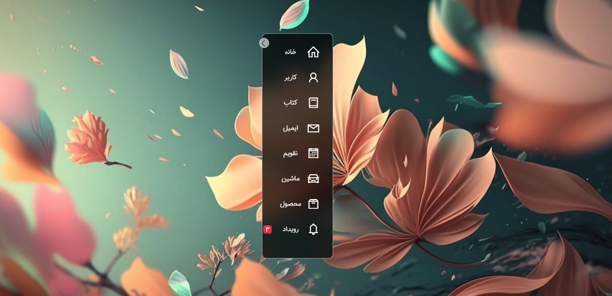

<div align="center">

# 🌐 Responsive Navbar
### Modern HTML & CSS Navigation Bar

<!-- Preview Image -->

 

<br/><br/>


</div>

---

## 📌 About The Project

This project is a **modern and responsive navigation bar (Navbar)** built using **pure HTML, CSS, and JavaScript**.  
It is designed to be **clean**, **lightweight**, and **easy to integrate** into any website.

---

## ✨ Features

- 📱 Fully responsive (Mobile / Tablet / Desktop)
- 🍔 Mobile hamburger menu
- 🎨 Modern UI design
- ⚡ Lightweight & fast
- 🧩 Easy to customize
- 🚫 No frameworks required

---

## 🛠 Tech Stack

| Technology | Usage |
|----------|------|
| HTML5 | Structure |
| CSS3 | Styling & layout |
| JavaScript | Menu toggle & interactions |

---

## 📂 Project Structure

```bash
sidbar_nave
├─ css
│  └─ style.css
├─ fonts
│  └─ Tanha-FD.woff2
├─ img
│  ├─ bg2.jpg
│  ├─ preview1.png
│  └─ preview2.png
├─ index.html
├─ LICENSE
└─ README.md

```
 